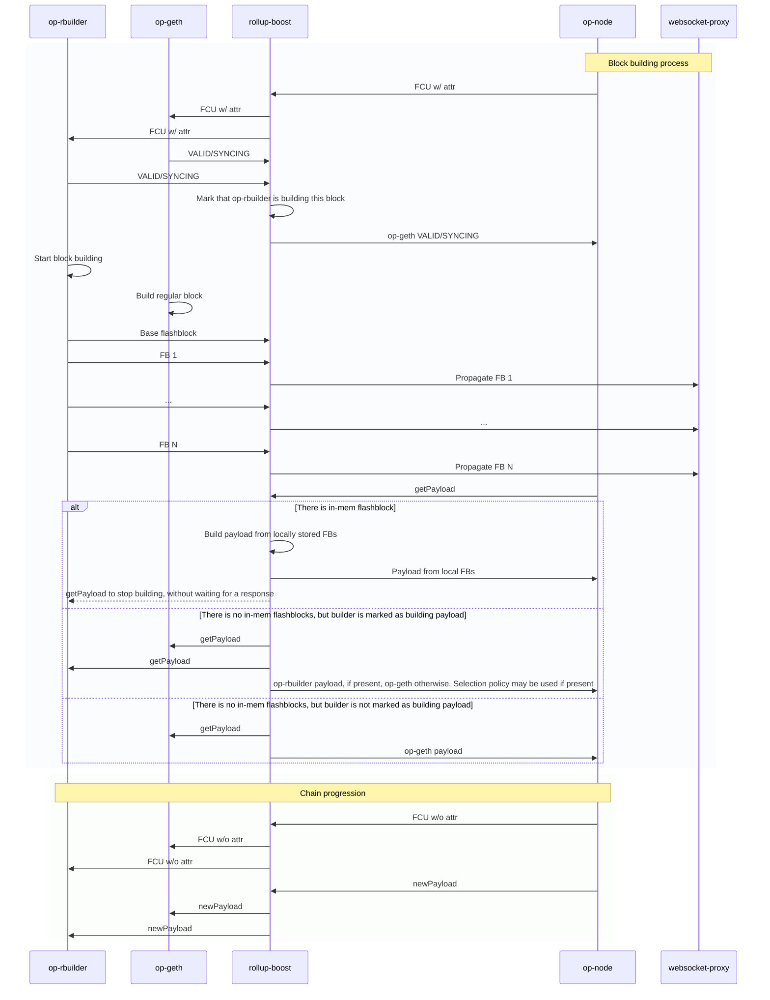
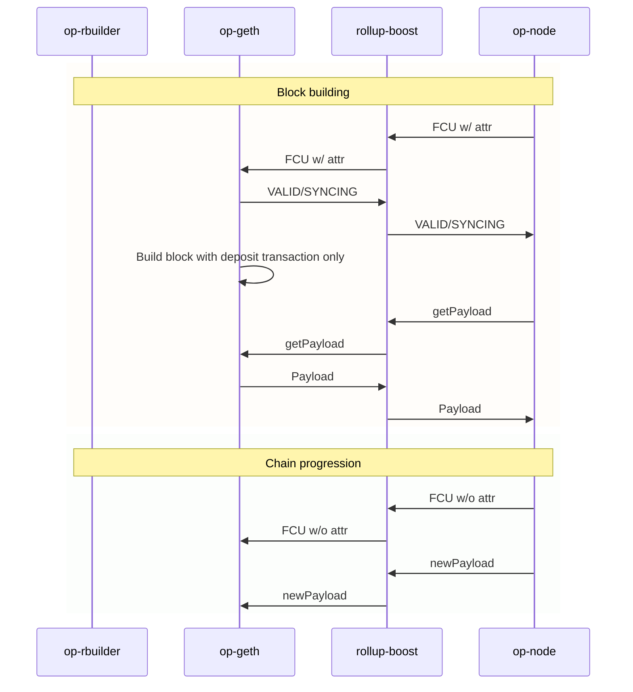

# Flashblock flow details

**FCU w/ attr - engine_forkchoiceUpdated with payloadAttributes**. This starts block building.

**FCU w/o attr - engine_forkchoiceUpdated without payloadAttributes**. This progresses the unsafe/safe/finalized head.

**newPayload - engine_newPayload**. This provides the execution client with new canonical block.
 
**getPayload - engine_getPayload**. Collects block building results. In flashblocks, this is only used to terminate block building as flashblocks are assembled on rollup-boost side. 

Flashblocks uses similar to canonical mechanism of block building, with the exception that it current implementation does not rely on getPayload.

It starts block building process on FCU w/ attr and try to time flashblocks, so all of them would be delivered before op-node issue getPayload to rollup-boost.

## build_payload Function Overview
This is the function that produces the block and contains all logic responsible for building the block and producing flashblocks
```pseudocode
function build_payload(build_arguments, best_payload_cell):  
    // 1. Set up the state for block building
    apply_pre_execution_changes()
    // === FALLBACK BLOCK CREATION ===
    // Produces deposits only block
    execute_sequencer_transactions()    
    // 2. Add builder transaction if we build block with txpool enabled (specified in FCU)
    if transaction_pool_enabled:
        add_builder_tx_after_deposits()
    
    // 3. Build and publish initial fallback block
    fallback_payload = build_block(state, context, execution_info)
    best_payload_cell.set(fallback_payload)
    // 4. Store the block in trie cache. This cache would be looked up on the next FCU w/ attr
    send_payload_to_engine(fallback_payload)
    // 5. Send fb via websocket
    publish_flashblock(fallback_payload)
    
    // 6. Return early if transaction pool is disabled
    if no_transaction_pool:
        record_metrics_and_return()
    
    // === FLASHBLOCKS TIMING CALCULATION ===
    // 7. Calculate dynamic flashblock timing and number of flashblocks we are able to produce based on the formula
    // first_offset = (block timestamp - current timestamp) % flashblock_time
    // flashblocks_count = (block timestamp - current timestamp) // flashblock_time
    // Ex: If we started building flashblocks at 400ms (because of network latency) that means we have only 
    // 600ms to build the block (assuming block time is 1s) 
    // If we have 250ms flashblock time, we could build only 3 flashblocks, the first one must be sent after 100ms and others 
    // after 250ms each.
    (flashblocks_count, first_offset) = calculate_flashblocks_timing(timestamp)
    
    // 8. Calculate resource limits per flashblock
    gas_per_flashblock = total_gas_limit / flashblocks_count
    da_per_flashblock = total_da_limit / flashblocks_count
    
    // === FLASHBLOCKS BUILDING LOOP ===
    
    // 9. Setup timing coordination. This timer task produces a cancel token that would be cancelled when it's time to 
    // send the flashblock. 
    setup_timer_task(first_offset, flashblock_interval)
    // 10. We use a custom wrapper around reth BestTransaction iterator. Our wrapper tracks committed transactions and skips 
    // them when we build a new flashblock.
    create_best_transactions_iterator()
    
    // 10. Main flashblock building loop
    loop:
        // Wait for next flashblock timing signal
        flashblock_cancel_token = wait_for_next_flashblock_signal()
        
        if flashblock_cancel_token is None:
            break  // All flashblocks completed or parent cancelled
        
        if reached_target_flashblock_count():
            continue  // Skip if we've built enough flashblocks
        
        // === SINGLE FLASHBLOCK BUILDING ===
        
        // 11. Provide a fresh BestTransaction iterator that would contain all transactions in mempool that could be 
        // included in the flashblock
        refresh_transaction_iterator_for_current_flashblock()
        
        // 12. Execute transactions within limits
        execute_best_transactions():
            while has_transactions() and within_limits():
                transaction = get_next_best_transaction()
                if can_execute(transaction, gas_limit, da_limit):
                    execute_transaction(transaction)
                    update_cumulative_usage()
                else:
                    skip_transaction()
                    // If we cannot fit a transaction, we will remove this tx and its ancestors from this round of 
                    // flashblock building
                    mark_invalid()
        
        // 13. Add builder transaction to last flashblock
        if is_last_flashblock():
            add_builder_tx_to_block()
        
        // 14. Build block and create flashblock payload
        (new_payload, flashblock_payload) = build_block(state, context, info)
        
        // 15. Wait for timing coordination
        wait_for_flashblock_timing_completion()
        
        if parent_build_cancelled():
            break  // If the main cancel token is cancelled we must start a new block building job and all previous
            // results are obsolete.
        
        // 16. Publish flashblock and update state
        publish_flashblock(flashblock_payload)
        best_payload_cell.set(new_payload)
        send_payload_to_engine(new_payload)
        
        // 17. Update limits for next flashblock
        increment_flashblock_index()
        increase_gas_and_da_limits_for_next_flashblock()
        mark_committed_transactions()
        
    // === CLEANUP PHASE ===
    
    // 18. Record final metrics and cleanup
    record_flashblocks_metrics()
    return success
```

### Timing Coordination
- **Timer Task**: Spawned async task that sends timing signals at regular intervals
- **First Offset**: Timeout after which we must send the flashblock. We calculate it so we send flashblocks at `current time % flashblock_time == 0`
- **Cancellation Tokens**: When we cancel the flashblock token we stop this flashblock building process and publish it.

### Caveats
If the system clock drifts too much we will print an error message and fallback to producing flashblocks with regular flashblock_time intervals, without adjusting anything.

## Block building flow
These are sequence diagrams for flashblock building flow, rollup-boost, op-node and fallback sequencer interaction.

There are 2 separate cases: for regular blocks and for blocks with the no-txpool flag. When building no-txpool blocks we are using only the fallback EL to construct the block.
This is done to rely on the canonical implementation for such blocks as they are not compute intensive.

### Regular Block Building Flow (Mermaid)



### No-Txpool Block Building Flow (Mermaid)

